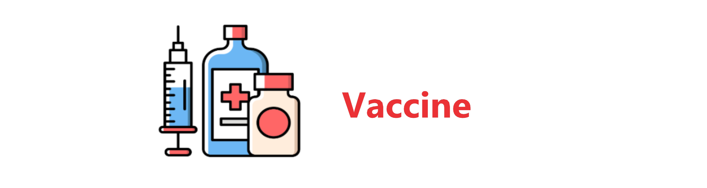

<!-- markdownlint-disable first-line-h1 -->
<!-- markdownlint-disable html -->

<div align="center">
  
</div>

<h1 align="center">Vaccine: Perturbation-aware Alignment for Large Language Model</h1>


Vaccine is a perturbation-aware safety alignment for large language models (LLMs). The alignment technique is developed mainly against the security risk in the user finetuning stage. 


## Main code logistic
We implement a customized trainer on top of the original HuggingFace Trainer. The main logistic is only 7 lines of code in `trainer.py`. 

```
self.pre_first_step(model) //Register gradient tracker for hidden embedding
step()  //Backward
self.after_first_step(model) // Cancel the gradient tracker  
model.zero_grad()
self.pre_second_step(model) // Calculate the perturbation and register the forward hook with  perturbation. 
loss = step() //Backward
self.after_second_step(model) // Cancel the forward hook
```
 


## Package requirement
The package requirement is listed in `vaccine.yml` and `vaccine_pip.txt`. Run the following code to install the packages with anaconda and pip.  
```
conda env create -f vaccine.yml
pip install -r vaccine_pip.txt
```

## Data  preparation
For finetuning task, we first need to run the following scripts to prepare the sueprvised finetuning data.
```
cd sst2
python build_dataset.py
cd ../gsm8k
python build_dataset.py
cd ../ag_news
python build_dataset.py
cd ..
```

## Huggingface Llama2 access
Llama2-7B is a gated repo, which need a formal request to get access to the model. Check out https://huggingface.co/meta-llama/Llama-2-7b-hf.
After applying permission from meta, you should be able to access the model, but you first need to enter your token in the file `huggingface_token.txt`.


## Example command to run

We prepare scripts for re-producing all the experiments in the paper. We recommend to use Slurm to reproduce the results as the logging file will be automatically organized into the script directory (if you don't use Slurm, just replace `sbatch` with `bash` in our example).

We first run Vaccine (with perturbation intensity=2) to produce the aligned model. 
```
cd script/alignment
sbatch  Vaccine.sh 2
```
Then we finetune the model using 10% of harmful data with a total number of 1000 samples from SST2 dataset. 
```
cd ../vaccine_finetune
sbatch  sst2.sh 2 0.1 1000
cd ../..
```

For comparison, the baseline SFT alignment can be run with the following code.
```
cd script/alignment
sbatch  SFT.sh 
```

Then we finetune the model with the same data setting.

```
cd ../sft_finetune
sbatch  sst2.sh 2 0.1 1000
```

## Citation
If you feel our project is useful, you may cite our paper with the following bibtex.
```
@article{huang2024vaccine,
  title={Vaccine: Perturbation-aware alignment for large language model},
  author={Huang, Tiansheng and Hu, Sihao and Liu, Ling},
  journal={arXiv preprint arXiv:2402.01109},
  year={2024}
}
```
